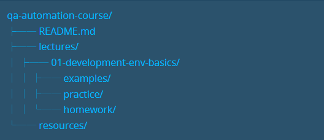

title:QA automation Environment Setup Guide"
author: Denitsa Mihaylova
date:2025-10-04
version: 1.0.0

# Description

This is an environment setup guide designed to help you through the installation process, show you the structure and scope of the project, and help you with some common issues.

## Prerequisites:

- Node.js v.22.20.0 + (ESLit v9 requires Node 22.20 or newer)
- npm 9+
- VS Code with ESLint and Prettier extentions

## Installation verification steps using your script:

1. Install Node.js
2. Check Node.js and npm installation using following commands in Tetminal: node --version and npm --version
3. Use mkdir to create folder qa-automation-course
4. Navigate to your project Directory using cd qa-automation-course
5. Run npm initialization command npm init and follow steps, provedes these details:

- Name: Use your directory name (qa-automation-course)
- Version: Keep default (1.0.0)
- Description: "QA automation course project for learning JavaScript and Playwright"
- Entry point: Keep default (index.js)
- Test command: Leave empty for now
- Git repository: Leave empty for now
- Keywords: "qa automation testing javascript"
- Author: Your name
- License: Keep default

6. Run your script.

## Troubleshoothing section with at leats 3 common issues ans solutions:

1. Check Execution Policy(Windows Only). If you're on Windows, PowerShell might be blocking script execution. Solution in that issue is to Run in PowerShell as Administrator: Set-Execution Policy RemoteSigned, confirmed with Y and try again: npm --version
2. If ESLint not running,ensure Node is installed property and tested again with node -version
3. When run eslint --init and go through the setup questions, one of the prompts asks: "Where does your code run" and options:Browser or Node. If you select Node, ESLint should configure the environment for Node.js but in the case generated browser in the end otf installation. To fix it must open eslint.config.mjs file and change the code and change intoby replacing it with 2 options:Node and browser.

## Project Structure

In the main folder we have 2 folders that called lectures and Resources also and README.md file. In the folder lectures еach lecture is named with the lecture number and a description, which should appear as follows:еx: 01-developement-env-basic. In the lecture subcategories, we have 3 subfolders:examples, homework, and practice. In the folder homework еach task is in a separate folder and is named task 01, task 02, etc.
